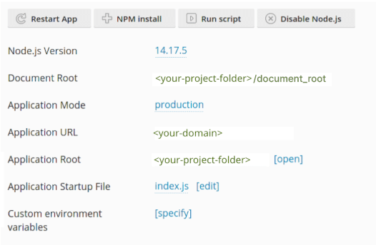

# Shared Hosting with Plesk

On many shared hosts you are not allowed to directly invoke node commands but you have to use the Plesk configuration
panel instead. Unfortunately, Plesk does not allow the interactive execution of node scripts. Therefore we can't use
Directus' `init` script and have to set up the project by our own.

::: tip Successful tests

This approach has successfully been tested with a webhosting offer from netcup.

:::

## Installation

### 1. Setup database

First, make sure that you've already created a database and a user for it. We will use MySQL in this guide. If you
plan to use SQLite you can ignore this step.

### 2. Setup a project folder

Next you will need to create a project folder, we will be adding 4 files to this folder.

### 3. Add .env file

This file is used to configure Directus. Normally, the `init` script would create it for us. So now we have to do it
manually. You can just copy it from another Directus installation or add the relevant variables using this help page:
[Environment Variables](/self-hosted/config-options/)).

If you have not already a user in the database make sure to add a first user by adding the following two lines so that
you can later login to Directus.

```
ADMIN_EMAIL="admin@example.com"
ADMIN_PASSWORD="password"
```

::: tip Choosing a Port

Since Plesk uses the [Phusion Passenger](https://www.phusionpassenger.com/) application server to serve Node.js apps you
do not need to worry about choosing a specific port. Just use an arbitrary number. To quote the Passenger docs:

> When run in Passenger, the port number that you pass to listen() is irrelevant and has no effect. Passenger always
> makes the app listen on a random Unix domain socket.

:::

### 4. Add package.json

Add Directus and your database connector as a dependency. To execute Directus' `bootstrap` command you also have to add
a script entry for it.

```json
{
  "scripts": {
    "bootstrap": "directus bootstrap"
  },
  "dependencies": {
    "directus": "*",
    "mysql": "^2.18.1"
  }
}
```

### 5. Add application startup file index.js

Instead of a start command, Plesk wants a startup file. So create a `index.js` with the following content:

```js
var { startServer } = require("directus/server");

startServer();
```

### 6. Add .npmrc

We need to make a small configuration for npm by creating a `.npmrc` file with the following content:

```
scripts-prepend-node-path=true
```

### 7. Add document_root folder

Lastly, we need to add a `document_root` folder inside our project-directory.

It's required by plesk that the document root must be a subdirectory of the application root directory. The folder can
stay empty.

::: tip Store `document_root` in a version control

If you want to keep the folder in in a version control like git, create a empty `.gitignore` file inside the folder.

:::

### 8. Activate and configure node.js

In Plesk, choose your website and click "Node.js". You should then see a button "Enable Node.js" and click on it.

Now, change the "Document root" and "Application root" to the location of your project folder. "Application startup
file" must point to the `index.js` file from the former step. The screen should now look like this:



You can now install the dependencies by clicking on the button "NPM install".

### 9. Bootstrap Directus

To set up the database tables (and the first user) for Directus, click on the button "Run script" and input `bootstrap`.
You get the console output after the script has run through.

::: tip Current Issue of Argon2

You may run into an error of argon2 telling you that glibc is missing. If that's the case try adding and running this
script entry to your package.json:

```json
    "scripts" {
        "argon2-rebuild": "npm rebuild argon2 --build-from-source",
        <...>
    }

```

Afterwards try `bootstrap` again.

:::

### 10. Clean up .env file

It is good security practice not to leave emails and passwords stored in plain text, so if you had to create login details through the .env file you should now remove those details from the file.

### 11. Test Directus Access

The Directus app should now work under your configured url. If not, try changing the application mode and wait a couple
of seconds.

## Using snapshots

On Plesk you can't directly run an npx command. To use the Directus snapshot feature, you'd need to add a script to your
`package.json`. For snapshot creation you can find an example in the
[CLI docs: Date-based snapshots](/self-hosted/installation/plesk#snapshot-the-data-model)

To apply a snapshot you need a custom wrapper using the non-interactive version:

```json
    "scripts" {
    	"apply-snapshot--noninteractive": "npx directus schema apply --yes ./snapshots/\"$npm_config_filename\"",
        <...>
    }

```

After that you can apply a snapshot by entering the following command to plesk:

```sh
apply-snapshot--noninteractive --filename=[file.yaml]
```
